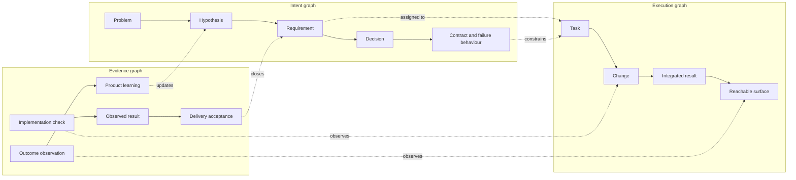
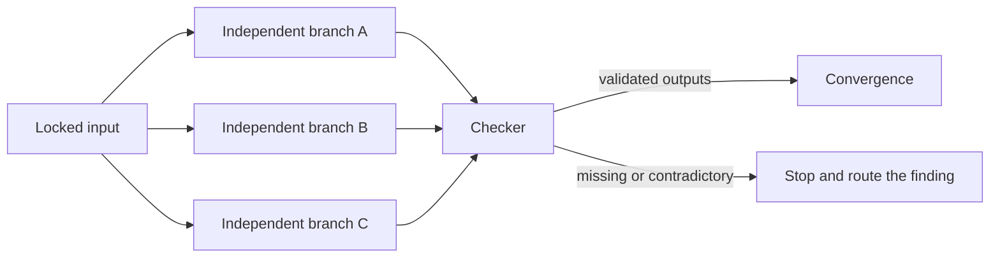
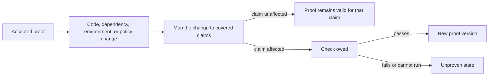
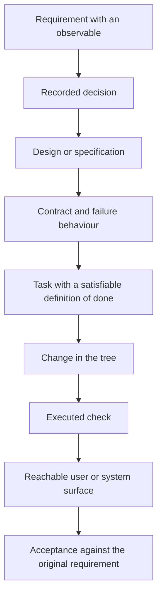
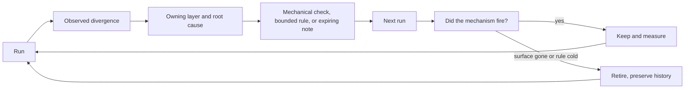

# Proof of Done: The Agentic Software Development Manifesto

**A foundation for building software when agents write the code.**

The task inventory was empty. The process was still running. I found this during a real agent run (not a simulation arranged to make the point): a monitor had been started to poll a remote check, the harness reported `No tasks found` one minute later, and the operating system still showed the poller alive more than 3 minutes after it started. Both observations were accurate. They were simply observations of different things. [E1](https://github.com/ssheleg/task-pipeline/blob/f0402c22b147d6d143c55833ef906fb817972ab9/plugins/task-pipeline/skills/task-pipeline/references/residue.md#L28-L62)

If you have used agents for sustained work, you probably know the shape. The agent completed the instruction. The tool returned success. The inventory was green. Yet the system was not in the state those signals appeared to describe, and no amount of confidence in the final message could close the gap (the subject of the check was wrong).

Coding agents have made producing software dramatically cheaper. They can create a feature, its tests, its documentation, and a convincing account of the work in one run, but they didn't make it equally cheap to know whether the feature is correct, whether the tests can detect its failure, whether the documentation still describes the code, or whether the original request survived the trip through all four. Imagine the cost model plainly: if a change takes 10 minutes to produce and 2 hours to reconstruct, generation speed has moved the expense rather than removed it. Those durations are illustrative. Every team should measure its own.

The bottleneck moved from production to assurance. This is why I no longer treat an agent's last message as the unit of progress. The useful unit is an **evidence-carrying change**: a change that carries the intent it implements, the evidence that verifies it, the limits of that evidence, and the decision that accepts it. I call the standard for that change **Proof of Done**.

## 1. When “done” broke

Traditional software development already has tests, code review, CI, runbooks, acceptance criteria, and a Definition of Done. None of those became obsolete when agents arrived (I use all of them). The problem is that the old system assumed a production rate and a shape of work that no longer hold.

An agent can produce changes faster than a reviewer can form a reliable mental model of them, lose part of the task across compaction or handoff and then continue fluently from an incomplete state, or write a test that agrees with its implementation because both contain the same misunderstanding. It can run a narrow suite and report the part as the whole. Several agents can act in parallel (each locally correct) while colliding on a shared file, contract, identifier, or external system.

The dangerous property isn't that an agent may be wrong. Developers have always been wrong. It is that an incomplete result can now arrive at high speed with code, tests, documentation, and explanation all supporting the same mistake.

I don't assume that an agent lies. I assume that it can be wrong, persuasive, interrupted, incomplete, and authorised to act. If you design only for malicious behaviour, you miss the ordinary failure: a system doing exactly what it understood, at a speed that makes the misunderstanding expensive.

That gives agentic development a specific threat model:

| Property | Failure it creates | System response |
|---|---|---|
| High production rate | More change than a person can inspect deeply | explicit scope and acceptance coverage |
| Plausible reporting | confidence mistaken for observation | artifacts over self-report |
| Context discontinuity | goals, decisions, and verified state drift | durable state outside the conversation |
| Nondeterministic execution | the route changes between runs | a stable result contract and recorded graph |
| Parallel agency | locally correct work collides at shared state | ownership and an explicit concurrency protocol |
| Operational authority | code generation becomes action on real systems | typed gates and bounded credentials |

The response cannot be “review harder.” Human attention is the resource agents were meant to stop consuming one keystroke at a time. If a feature takes 15 minutes to generate and an hour of archaeology every time it reaches review, the operating model has failed even when the code is correct. I want a system in which the routine path is autonomous, consequential boundaries are explicit, and you can challenge every completion claim without reconstructing the whole conversation (or trusting the agent that produced it).

## 2. What Proof of Done means

Definition of Done and Proof of Done answer different questions.

> **Definition of Done states what must be true. Proof of Done shows that it is true.**

More precisely:

> **Proof of Done requires every completion claim between an intended outcome and an accepted result to point to its supporting record at an address another actor can resolve; if the address does not resolve, the claim is not proven.**

This is an operational boundary. “The tests pass” is a claim. The command, its exit code, the selected test names, the commit they ran against, and the stored result are evidence. If you cannot resolve the test name, you don't have that evidence. If you cannot open the CI run, the badge proves only that a badge was rendered. A report that says nothing about what was skipped cannot distinguish a clean result from a check that never looked (two opposite states with the same output).

Proof of Done is not a mathematical proof of correctness. Most software teams can't produce one, and pretending otherwise would make the term useless. It is a bounded engineering claim supported by evidence that another person or mechanism can reach, which is why every proof is **scoped, versioned, and perishable**. It belongs to a particular change, environment, set of checks, policy version, and observation time (the validity domain of the claim). A green result on commit A does not prove commit B, a staging smoke test does not silently become production evidence, and a document that was true one month before a migration doesn't remain true by inertia.

### The smallest protocol

The smallest useful version of this manifesto fits in four fields:

```text
DONE
  What became true.

PROOF
  What was executed or observed, and where the result lives.

SCOPE
  The commit, environment, requirements, and surfaces covered.

NOT VERIFIED
  What was not checked, could not be checked, or remains uncertain.
```

An agent shouldn't return `done` without those fields. `NOT VERIFIED: none within the stated scope` is a valid answer. Silence is not. If you adopt nothing else in this document, these four fields already separate completion from a plausible completion story.

The difference is visible in a small example. The identifiers are illustrative:

```text
Agent report:
  Done. Implemented UTF-8 export support. Tests pass.

Proof of Done:
  DONE: UTF-8 report export implemented at 5f21ac3.
  PROOF: test_export_preserves_utf8 passed in CI run 1842.
  SCOPE: Linux / Node 24 / REQ-014.
  NOT VERIFIED: Excel import on Windows.
```

The first report asks for trust. The second gives you places to disagree.

The word `done` also hides several states that should not be collapsed:

| State | What it says |
|---|---|
| `generated` | an artifact exists |
| `executed` | code or a check ran |
| `passed` | a successful result was observed |
| `verified` | an appropriate check ran and has demonstrated that it can discriminate failure from success |
| `validated` | the result addresses the intended user or system outcome |
| `accepted` | required coverage is closed and every remaining limit is explicit |

The common failure is a jump from `generated` to `done`. Once you name the intermediate states, you can see where the claim outran the evidence and stop there without pretending the whole change failed.

### The four values

We value:

**Evidence over confidence.** A calm, detailed report isn't stronger than the artifact it describes. **Intent over output.** A large change cannot compensate for a requirement that disappeared before implementation. **Explicit structure over emergent motion.** Activity is not a plan, and chronology is not dependency. **Durable truth over conversational state.** The context window helps an agent think, but it isn't the system's memory.

The items on the right still matter. Confidence helps people act, output is why the work exists, discovery changes plans, and conversation is where much of the reasoning happens. The items on the left are what make their results trustworthy (and what let you disagree with the result precisely).

This does not mean every change needs the same pipeline, every uncertainty can be automated away, every agent needs a person watching it, or every internal thought belongs in a permanent log. Proof should be proportionate, privacy-preserving, and produced by the work itself. The standard governs the completion claim, not one mandatory toolchain.

## 3. The three graphs

Agentic development is usually drawn as one pipeline: prompt in, code out. When you draw it that way, you omit the two graphs that decide whether the output is useful. A complete system aligns three graphs (not three documents that happen to use the same feature name).

### The intent graph

The intent graph says why the change should exist and what must become true. It starts before requirements, with a user or system problem, a hypothesis about what will improve it, and a signal that could show whether the hypothesis survived contact with reality. Requirements, decisions, constraints, scenarios, contracts, and failure behaviour follow. I treat a requirement with no observable as unfinished because you cannot connect it to the evidence graph later without inventing the test after seeing the implementation.

### The execution graph

The execution graph says how the change will be produced. Its nodes are tasks, owners, transformations, integrations, and gates (the pieces you can schedule, isolate, retry, and inspect). Its edges are real dependencies.

### The evidence graph

The evidence graph says how the result will be known. Its nodes are assertions, test runs, reviews, measurements, deployment observations, reachable surfaces, outcome observations, and acceptance decisions. If you build this graph only after the code exists, you have already let the output decide what counts as success.

Two things run on opposite clocks here, and collapsing them produces a rule nobody can follow. The **observable** is a criterion — what would count as success — and it belongs before the implementation, because a requirement with no observable cannot be attached to evidence later without inventing the test after seeing the code. The **corpus** is a sample — which inputs you actually have — and most of it arrives from production, because inputs invented up front test your imagination rather than your system. Neither displaces the other: a requirement that ships without an observable is unfinished, and a corpus with no real traffic in it is a guess. Read as one thing, they contradict — "decide the check first" against "don't author fixtures you haven't seen" — and a team that resolves that contradiction in either direction loses something it needed.



Done is not a status attached to the task node. It is a coverage relation across the three graphs: for every required outcome, there must be a continuous path through the work that implemented it, the check that observed it, and the acceptance that closed it. If the path breaks, you may still have a promising, useful, or partially complete change. You do not have proven completion.

Product truth needs one more distinction. A change can be implementation-verified and product-unvalidated. Delivery acceptance proves that the team built the agreed change and exposed it correctly. It does not prove that the hypothesis was right, that people will use the result, or that the expected outcome will move. Some outcome evidence cannot exist until after release, so `unobserved` is a legitimate product state. Pretending delivery proof is outcome proof is not.

> **Proof of Done does not require a product hypothesis to be true before it can be tested. It requires the hypothesis, its success signal, and its current evidence state to remain explicit.**

This model catches a class of failures that document-by-document review misses. A specification may be internally consistent, a plan may cover every heading in that specification, the code may satisfy the plan, and the tests may satisfy the code, while the delivered surface still fails the original requirement because the loss happened between layers. In my runs, walking the seams has been more informative than spending another pass polishing any single artifact.

### A node has one job

A useful node has one input, one job, one output, one owner, and its own completion test. “Research the problem, design the solution, implement it, and verify it” is not a node. It is four nodes wearing one name, which means you cannot tell which part deserves a retry when the combined result fails. The node is the unit that can be retried, reviewed, cached, replaced, or assigned to an isolated agent (a separate context window is often the real benefit). Smaller does not always mean better, but mixed responsibilities make failure impossible to locate.

### An edge carries an artifact

An execution graph is not a list with arrows. An edge exists only when the downstream node consumes something the upstream node produced, and that thing should be named (a file, schema, signature, decision, value, fixture, identifier, or verified result).

> **An edge that carries no named artifact is chronology drawn as architecture.**

This gives you a simple fake-edge test. Draw the tasks and the proposed arrows, then write what crosses each arrow. If you can't name the payload, delete the edge. Work with no remaining incoming edge can begin immediately. On a wide plan, removing false waiting can save an afternoon without adding a single agent (a local cost to measure, not a universal benchmark).

The test reveals both safe and false parallelism. Two tasks with different names are not independent when both mutate the same target. Shared mutable state requires an explicit concurrency protocol. Without one, it has one owner at a time (a file, decision register, schema, namespace, or remote resource can all be the target). Git records what happened after a write. It doesn't say who is about to write now.

### Parallel work needs a checker

Fan-out is cheap. Trusting every branch because it returned isn't. A wide parallel run can create more review surface than one person can inspect before the context that produced it has already moved on.



The checker confirms that every expected output arrived, matches its contract, carries its evidence, and does not contradict a sibling (including a sibling that used different words for the same shared assumption). Convergence shouldn't quietly repair malformed inputs. It either consumes validated results or stops.

The checker needs proof too. A mechanism that always returns green is only another agent-shaped source of confidence. Before I trust a new check, I want evidence that it can discriminate failure from success (a planted defect, mutation test, known failing fixture, or recorded historical failure can provide it). You don't need to repeat the negative control on every run, but you do need to know that green has an opposite state. In the reference implementation this is a suite rather than a habit: every guard is fed a planted defect and required to reject it, and a check that no longer rejects its own plant is a red step rather than a green one. [negatives](https://github.com/ssheleg/task-pipeline/blob/17ef1a6346384094455ae3fa0ffadf790b586d83/test/negatives.py)

### Stable graph, bounded discovery

The planned dependency graph should be acyclic, retries should be bounded, and learning should remain cyclic. Discovery is allowed to reveal missing work, a new dependency, or a bad module boundary. It may propose a new graph, but it may not silently become one. I record the revision and its reason, then make the graph stable again before execution continues (otherwise the run can always explain completion by appealing to a plan that existed only at the end). A self-modifying graph may be flexible, but if you cannot reconstruct its shape, you cannot falsify its completion claim.

## 4. Bounded autonomy

The answer to agent risk is not constant supervision. If you must approve every file read, test command, or local edit, the agent is an expensive keyboard macro. Even a hypothetical 30-second local operation can then acquire an hour-long human round trip. Autonomy should be granted before execution and interrupted only at named boundaries. I see three parties in that arrangement (not the usual two).

The human owns meaning: goals, trade-offs, unresolved product decisions, acceptance policy, and authority over consequential actions. The agent owns execution: investigation, decomposition, implementation, testing, evidence collection, documentation updates, and the honest reporting of limits. The mechanism owns enforcement: schemas, permissions, gates, isolation, leases, logs, state, and the checks that must run even when nobody remembers to ask.

Anything a mechanism can decide reliably shouldn't depend on an agent remembering a paragraph. Prompts remain useful, but they are the weakest control surface in the system. A test is stronger than an instruction, a precondition is stronger than a warning, and a credential that cannot reach production is stronger than a sentence saying not to use it there (because the last control still works after context loss).

### Three gate types

An automatic gate decides a fact a machine can establish: a schema resolves, a suite ran, an expected artifact exists, a reference points somewhere real, or all required ids appear in the coverage table. A judgment gate evaluates something that has no complete deterministic check (architectural coherence, visual quality, whether a user flow makes sense, or whether a trade-off is acceptable). Another agent can perform this review, preferably with an isolated context, but its verdict remains judgment and should be labelled as such. A manual gate protects ambiguity, external publication, irreversible action, money movement, production access, destructive operations, and changes of scope. The agent prepares the decision and its evidence. The authorised person decides.

### When the actor is an agent

When an agent produces the change, the proof should identify the execution that produced it: model and runtime, policy and instruction versions, tools and permissions, context boundaries, retries, abstentions, and the trace that connects actions to results. A correct final artifact can follow an unsafe trajectory, while a clean-looking trajectory can still produce the wrong artifact. Proof of Done needs enough provenance to investigate both without preserving every private token forever.

A second agent is not automatically an independent reviewer. If implementer and reviewer share the same model, context, sources, specification error, and judge, their agreement can be one correlated mistake reported twice. Independence comes from a different evidence path: a deterministic runner, a contract maintained at another boundary, an isolated context, a differently calibrated judge, an external system, or a production observation.

Where the check itself is probabilistic, its proof includes the rubric, calibration evidence, trace ids, and abstentions. A judge that has never been observed disagreeing is the agentic version of a green check nobody watched turn red.

Not every acceptance requires a human click. You can define a policy that closes low-risk changes automatically, while a human owns the policy and its boundaries rather than every invocation of it. The point isn't to place a person everywhere. It is to place authority where the cost of a wrong action lasts longer than the run. Imagine 2 weeks of cleanup after a careless migration: that is not autonomy, no matter how quickly the migration was generated.

### One item to its gate

Continuous execution should advance one recorded item to its next gate, then re-read the goal and queue before selecting another. The queue lives in an artifact, not in the agent's recollection of the plan. This prevents a common form of drift: the agent continues efficiently after the reason for the next task has changed. I don't call a loop without a durable queue autonomy. It is a timer attached to memory. The loop stops for a manual gate, an unresolved dependency, genuine ambiguity, or completion, but it doesn't stop to ask whether it should continue when that choice was already granted at intake.

### Churn is a decision at the wrong layer

A repeating loop should record what changed, why it changed, what new information arrived, and which pass produced it. Memory isn't enough after compaction, and “one more pass” isn't an exit criterion, especially when consecutive rounds touch the same file for the same reason.

Stop when a change returns from shape A to shape B and back to A, the same file is edited twice for the same finding, a closed finding is resurrected, or two stages keep handing the artifact back. If you see one of those patterns, a requirement, contract, review rule, or module boundary is probably being re-decided inside the code.

> **Never resolve a higher-layer conflict inside a lower-layer loop.**

[loop guard](https://github.com/ssheleg/task-pipeline/blob/17ef1a6346384094455ae3fa0ffadf790b586d83/plugins/task-pipeline/skills/task-pipeline/references/loop-guard.md#L51-L72) — the detection rules, and the bookkeeping that makes them mechanical rather than a matter of noticing.

If the plan contradicts the specification, return to the specification or plan. If two modules claim the same entity, repair the decomposition. I have never seen patching code until it satisfies two incompatible meanings resolve the disagreement. It only hides where the conflict belongs (and charges the next run for finding it again).

## 5. The Proof record

For a larger change, the same contract becomes a portable record. The format below is illustrative rather than mandatory (I care about the fields, not the serialisation). You should be able to render the same record as Markdown for a person and as structured data for a gate.

```yaml
proof_of_done:
  intent:
    problem: "Reports with non-ASCII titles cannot be exchanged reliably"
    hypothesis: "A UTF-8 export removes the failure at the exchange boundary"
    success_signal: "A real downstream importer preserves the title"
    requirements: [REQ-014]
    decisions: [DEC-0031]
  producer:
    actor: "coding-agent"
    model: "model-id"
    runtime: "agent-runtime@version"
    policy: "delivery-policy@7"
    instructions: "instructions@commit"
    trace: "trace://run/1842"
  change:
    commit: "5f21ac3"
    artifacts:
      - "src/export/report.ts"
  evidence:
    - claim: "Non-ASCII report titles survive export"
      check: "test_export_preserves_utf8"
      result: "passed"
      artifact: "ci://run/1842"
      environment: "node-24-linux"
      demonstrated_failure: "mutation://run/1839"
      observed_at: "timestamp"
  product_evidence:
    status: "unobserved"
    observation: "pending downstream import"
  validity:
    applies_to: "commit:5f21ac3"
    invalidated_by:
      - "code-change"
      - "dependency-change"
      - "environment-change"
      - "policy-change"
  not_verified:
    - "Excel import behaviour on Windows"
  exceptions: []
  acceptance:
    delivery_status: "verified"
    product_status: "unobserved"
    policy: "delivery-policy@7"
    accepted_by: "release-gate"
```

The record doesn't need to become paperwork completed after the work. It should be assembled from artifacts the work already produces: requirement ids from intent, commits from version control, checks from the runner, environment and policy versions from the execution trace, and acceptance from the resulting coverage. Evidence should be produced as a side effect of the work. Every field completed manually after the run is automation debt.

Use the cost as a design test: if maintaining proof takes 20 minutes after a hypothetical 5-minute edit, the implementation is wrong. The system should compute what it can and ask for judgment only where computation ends.

### What counts as evidence

Evidence has an address and a scope. It may be a command with output, an executed test by name, a commit, a trace id, a deployment identifier, a screenshot tied to a scenario, a production observation, or a decision record. The medium is less important than three properties: you can resolve it, it belongs to the change being claimed, and it proves no more than it observed (the last property is the one green dashboards routinely lose).

The producer of a claim shouldn't be its only judge. Independence can come from a deterministic runner, a contract test maintained at another boundary, an isolated reviewer, an external system, or production telemetry. I don't need a human reviewer for every line, but I do want the strongest evidence farther from the component that produced the claim as the cost of being wrong rises (a billing webhook and a colour token shouldn't carry the same burden).

An honest negative is evidence too. “Not done: the production check requires a credential this run does not have” is a complete report. “Done, with one small caveat” for the same state is not. A closed status vocabulary helps because you can route each state without negotiating its meaning again:

| Status | Meaning |
|---|---|
| `verified` | required evidence exists within the declared scope |
| `partial` | only a named portion is complete |
| `deferred` | the remainder has an accepted owner and destination |
| `dropped` | the requirement was explicitly removed by an authorised decision |

`unknown` may appear during work. It cannot close acceptance (otherwise uncertainty becomes the easiest route through the gate).

### Proof expires

Evidence remains attached to the state it observed. A code change, dependency update, environment change, policy revision, or expired outcome window can invalidate part of the proof without making the historical record false. The record should therefore say both what it applies to and what would invalidate it.

Invalidation is not deletion. The old proof remains useful for reconstruction, while the current change returns to the earliest uncovered node in the evidence graph. Re-running every check after every edit wastes time. Re-running none of them turns history into fiction. The dependency between change and evidence decides which checks are owed.



### Documentation is part of the proof

A claim without a reachable proof is not documentation. It is decoration. Every fact should have one authoritative home, while other documents link to it or compute from it rather than hoping every future agent edits all copies. Numbers should be computed rather than carried from an earlier report. References should resolve from where the document is read. What wasn't checked should sit beside what was, an estimate shouldn't be printed as a measurement, and documentation and code should ship in the same release unit (even when they live in different repositories).

This isn't style guidance. Documentation is durable context for the next agent. If it lies, the next run begins with a fabricated premise. A hypothetical 2 days of clean work against the wrong system is enough to erase any time saved during generation. I have found stale documentation more dangerous than missing documentation because you know to investigate the second one.

### Context is cache

The conversation helps the agent reason. Durable state belongs outside it. Goals, requirements, decisions, module maps, current ownership, verified work, open questions, and acceptance records should survive compaction, process failure, and a change of agent. A path costs a few tokens and can name an artifact of any size. A summary costs more and can still omit the one constraint the next run needed (summarisers preserve stories better than exact state).

At a context boundary, transfer typed state rather than a new narrative: the active goal, the current item, restrictions, files touched, checks already run, unresolved decisions, and the next gate. If you know a compaction boundary is close, finish the in-flight item and make the ledgers true rather than opening another branch. The transcript can be compressed. The contract cannot.

## 6. Acceptance walks the seams

Every earlier gate asks whether its own artifact is good. Delivery acceptance asks whether anything disappeared between them (a different question with a different search strategy). Product learning then asks whether the accepted surface changed the outcome named in the hypothesis.

The delivery walk starts at the requirement and crosses every layer:



At each seam, ask one narrow question. Did the requirement rest on a decision somebody actually made? Did the decision reach the specification? Did the specification define a contract and its failure behaviour? Did a task build that contract? Did the change satisfy the task as written? Did an executed check observe the changed behaviour? Can you or a downstream system reach it? Does the result satisfy the original requirement rather than the local interpretation that emerged halfway through the run?

Horizontal review compares artifacts that already exist and finds contradiction. The seam walk can find absence because each rung tells us what artifact should exist next (you can finally look for the missing side of a comparison).

This distinction mattered in my own pipeline. Repeated horizontal audit passes continued to find defects, but an increasing share came from the previous pass's own edits. By pass 6, 10 of 13 findings were self-inflicted. The trend is measured over passes four to six; a seventh pass fell back to 4 of 19, and the record does not say what that pass did differently. I am naming that rather than ending the series at six, because the table this citation opens on carries the seventh row, and deleting a measured row to protect a claim is the opposite of what this document asks for. A vertical pass over one capability found missing layers the document-to-document comparisons could not represent. I didn't need another careful reading. I needed a different axis. [E2](https://github.com/ssheleg/task-pipeline/blob/17ef1a6346384094455ae3fa0ffadf790b586d83/plugins/task-pipeline/skills/task-pipeline/references/audit.md#L44-L64)

### Release acceptance happens at convergence

A component is not accepted merely because its own repository is green. The backend, client, infrastructure, documentation, and configuration may each be correct against different versions of the contract. Release acceptance belongs at the point where their exact versions converge and the cross-component path is observed.

This is the same rule as parallel branches in a smaller graph. Local proof travels with each component. The release proof verifies the composition. A submodule, package, or service is finished for the release only when the system that consumes it identifies the accepted version and proves the seam. The mechanical form is small and easy to forget: a parent records a submodule as a pointer to one commit, so the work can be committed, pushed and green while a clone of the parent still gets the commit before it — neither repository looks wrong alone. [convergence](https://github.com/ssheleg/task-pipeline/blob/17ef1a6346384094455ae3fa0ffadf790b586d83/plugins/task-pipeline/skills/task-pipeline/references/acceptance.md#L155-L190)

### Completion includes residue

A run produces more than a diff. It can leave background processes, monitors, scheduled wake-ups, worktrees, containers, leases, scratch files, test data, draft pull requests, uploaded artifacts, and changed feature flags. I once measured 18 containers still running across four unrelated projects, the oldest alive for 3 days. Proof of Done records what remains (it does not grant authority to delete all of it). [E4](https://github.com/ssheleg/task-pipeline/blob/f0402c22b147d6d143c55833ef906fb817972ab9/plugins/task-pipeline/skills/task-pipeline/references/residue.md#L187-L220)

The run may end what it started. It may remove older state from the same project only when that state is provably spent. It reports foreign or ambiguously owned state and leaves it alone. If you don't know who owns a resource, a clean number is not worth deleting someone else's work.

Teardown is verified by re-reading state, not by trusting the cancellation response. An API can accept a request to stop something that was already gone, so you need the second observation (the reply proves the call was accepted, not that the world changed).

### A walking skeleton comes first

Agents are unusually good at generating volume, which makes breadth-first implementation tempting and dangerous. Build the thinnest real path first: real input, real contract, minimal implementation, real storage or integration, reachable output, and one end-to-end observation. Then expand by independently testable modules. If the first real case still cannot move through the system, a shelf of finished components is inventory rather than progress (a walking skeleton is the first evidence that a system exists).

## 7. The system learns

The planned work graph should converge. The engineering system around it should learn forever (the first is delivery, the second is adaptation).

A retrospective is owed when the run diverges: a gate reopened, a stage was re-entered, a fix broke an unrelated surface, an assumption turned out to be false, or a person had to intervene where the operating contract said they wouldn't. I don't write one merely because a run ended. A ritual retrospective consumes time and teaches the system that silence means success.

The lesson should name the symptom, where it surfaced, which earlier layer let it through, the root cause, the correction, the check that would have caught it sooner, and the commit that carries the fix. “The agent was careless” isn't a root cause. If you cannot turn the explanation into a changed mechanism or decision, the next run has nothing to execute differently.



There are three grades of learning.

The strongest is mechanical: a test, lint rule, gate, hook, schema, or policy. The check becomes the memory, so no agent has to read the lesson again. The second is a standing instruction for decisions a mechanism cannot make (it needs an owner and a retirement condition when it is born). The third is an expiring note for something still being understood. It gets promoted to a mechanism or instruction, or it disappears. A permanent pile of lessons becomes a context tax. Eventually agents skim the whole thing, including the few rules that mattered.

> **A failure class that repeats becomes a mechanism, not another paragraph.**

The reverse matters as much. When a rule becomes a check, the prose rule should retire. When the surface it protects disappears, the rule should retire. I keep the history reachable but the active instruction floor short enough to read (a rule that costs tokens forever needs to keep earning them).

## 8. From four lines to a full pipeline

This manifesto doesn't require every typo to cross a full delivery process. The amount of machinery should be proportional to the cost of being wrong (and the reversibility of the action).

A local, mechanical, reversible edit may need a narrow check, a diff inspection, and the four-line Done Report. A normal feature or fix needs explicit intent, a work graph, implementation, review, the appropriate suite, documentation, and acceptance coverage. A change that moves money, reaches production data, changes access, deletes state, or sends an external message needs isolation, independent evidence, bounded credentials, manual authority at the consequential boundary, rollback, and a post-action observation. You should be able to explain why the second path costs more than the first without appealing to ceremony.

The ceremony changes. The requirement for honest evidence doesn't.

### Proof depth follows risk

How much proof is enough? A hypothetical one-hour manual checklist is too much for a reversible edit and may be too little for a production deletion, so the required proof grows along four inspectable axes rather than a universal score:

| Axis | Question |
|---|---|
| Impact | What can be harmed if the claim is wrong? |
| Irreversibility | How difficult is the action to undo? |
| Uncertainty | How much of the behaviour cannot be checked deterministically? |
| Coordination | How many agents, repositories, services, and owners meet at the change? |

These axes are not a fake numerical score. They are a reason the team can inspect. A local reversible edit and a production migration do not need equal ceremony, while both still owe an honest statement of what was checked.

### Policy, exceptions, and ownership

Proof of Done is the interface between autonomous production and organisational trust. A team therefore needs one owner for the acceptance policy: which evidence types are allowed, which gates are manual, what independence means at each risk level, how long evidence remains valid, and who may change those rules. Every acceptance records the policy version that governed it.

Exceptions will exist. Hiding them in chat is optional governance. A real exception carries an owner, reason, scope, expiry, compensating control, and the authority that accepted it. It does not rewrite `partial` as `verified`, and it cannot silently become the default for the next run.

The cost compounds quickly: a hypothetical waiver that saves 10 minutes now and is rediscovered on every later run is deferred process design, not saved time.

The useful measurements follow from the model: requirements with no evidence path, `unlooked` and `abstained` checks, reopened gates, false-green incidents, invalidated proofs, repeated failure classes, manual proof fields that still need automation, and the time between implementation complete and accepted. Lines of generated code do not appear on that list.

Teams can adopt the model in layers:

1. Replace bare `done` with `DONE`, `PROOF`, `SCOPE`, and `NOT VERIFIED`.
2. Give every requirement an observable check, and every product hypothesis a success signal.
3. Draw dependencies as artifact-carrying edges and add ownership for shared mutation.
4. Record the provenance of agent-produced changes and the independence of their review.
5. Build acceptance coverage across intent, execution, evidence, and the release convergence point.
6. Turn repeated failures into mechanisms and retire the prose they replace.

I didn't arrive at this model by designing an ideal process on a blank page. I arrived at it while building and repeatedly breaking a working agent delivery system (the failures above are records from that work). Rules that existed only in prose were skipped. Green checks turned out not to observe their subject. Reviews began finding defects introduced by the previous review. Context summaries preserved the story and lost the state. Each failure added a mechanism, or removed a rule that had been pretending to be one.

One reference implementation is packaged in my [sshlg-skills](https://github.com/ssheleg/sshlg-skills) project. At [`0fb706c`](https://github.com/ssheleg/task-pipeline/commit/0fb706ca28c3ec127875ee891235f32cdb8346ba), I had not yet built four requirements this manifesto names: judgment gates, resolvable requirement-to-execution edges, per-node completion checks, and proof invalidation. They were filed as open backlog rows [B-076 and B-077](https://github.com/ssheleg/task-pipeline/blob/404fd09afd919d57834a095d05ddaa4f0d693d9c/docs/evidence/backlog.md#L21-L22) and [B-080 and B-081](https://github.com/ssheleg/task-pipeline/blob/404fd09afd919d57834a095d05ddaa4f0d693d9c/docs/evidence/backlog.md#L15-L16) rather than described as shipped. **All four have since been built** — a judgment gate the schema distinguishes from a measurement at [`9d8695d`](https://github.com/ssheleg/task-pipeline/commit/9d8695dc4b73da5b65f2dde6894d351f2e738612), a `serves` edge that must resolve at [`fbd8a67`](https://github.com/ssheleg/task-pipeline/commit/fbd8a67e6988a0893f273eb37bd9a075a036c223), expiring verification at [`0bc5eb6`](https://github.com/ssheleg/task-pipeline/commit/0bc5eb632e6c94181c528cf8cff315e2b7c5a2a9), and a node that states its own completion check at [`8b7de18`](https://github.com/ssheleg/task-pipeline/commit/8b7de18eceb8b3f58ceea35410201344bf470f49) — the last of them on 2026-08-19, two days after this paragraph first claimed all four were open. That gap is the subject of this document happening to it: those two permalinks still resolve and still read `open`, because a permalink is pinned to a commit, so for a day and a half the receipt confirmed a belief that had stopped being true. **A citation that resolves is not the same as a citation that is current**, and only the first of those was ever checked here. The launcher installs the implementation as Claude Code plugins and as portable Agent Skills for other coding agents through one command. [E3](https://github.com/ssheleg/sshlg-skills/blob/b01050170cf8c2a7ee56f645e2d01e87cf3b0d17/README.md#L7-L16)

```bash
npx sshlg-skills install
```

The implementation is evidence that this process can run. It isn't the authority for the manifesto. You should still be able to use the four-line protocol, the three graphs, and the seam walk if every tool, runtime, and package name in that repository changes.

## The declaration

We believe the unit of progress is not generated code but an evidence-carrying change, and that intent must survive decomposition, implementation, verification, and acceptance without becoming a different request at every boundary.

We believe implementation proof and product proof are different. A change may be ready to release while its product hypothesis remains unobserved, and the system should preserve that uncertainty rather than promote it to success.

We believe an agent's report is a useful interface and an insufficient source of truth. Agent-produced work carries provenance, and agreement between two agents counts as independent evidence only when their evidence paths are genuinely independent.

We believe autonomy should expand where evidence and limits are mechanical, then stop where meaning, authority, or irreversible consequence begins (the boundary should be visible before the run reaches it).

We believe the work graph should expose dependencies, the evidence graph should expose uncertainty, and acceptance should reconnect both to the original intent. Unchecked, abstained, partial, deferred, and unknown are engineering states, not embarrassing words to hide behind `done`.

We believe documentation is part of the executable memory of a software system. A fact with two homes will diverge, a number copied from an earlier report will decay, and a reference that does not resolve is a claim with its receipt removed. Evidence is versioned and perishable, and invalidation preserves history without pretending the old proof still covers the current state.

We believe every repeated failure should make the next run structurally better. The best lesson is the one no future agent has to remember because a mechanism now carries it (and the best retired rule leaves its history behind).

Agents can produce code, tests, documentation, and convincing explanations at extraordinary speed. None of those artifacts proves the others.

The future of software development will not be secured by making agents generate more. It will be secured by making intent explicit, work inspectable, autonomy bounded, checks falsifiable, state durable, and completion provable.

The agent may write the code.

The system must carry the proof.

**When agents write the code, done is not the last message of the run. Done is a state of the system that can be proven.**
